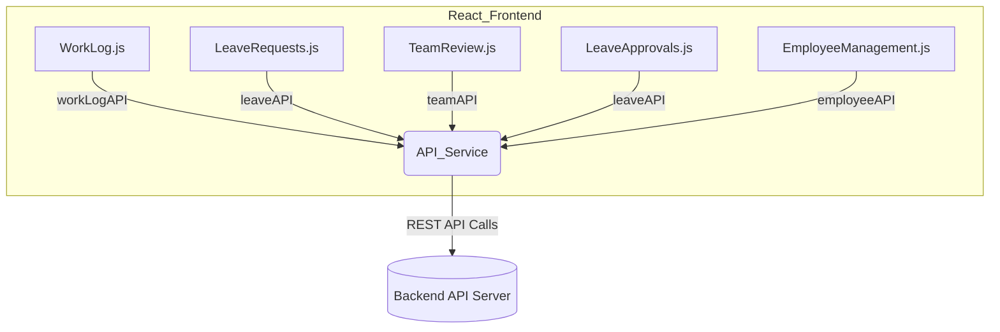

# Frontend Analysis: Usage of Mock/Hardcoded Data vs. Backend API Integration

**Scope**: React codebase for the Employee Activity and Management System  
**Goal**: Identify all current usages of dummy, hardcoded, or mock data; map areas that require integration with real backend APIs; and highlight discrepancies or integration gaps.

---

## Summary Table

| Area (Component/Page)     | Data Source      | Backend API Used     | Mock/Hardcoded Data Present?    | Gaps/Notes                  |
|---------------------------|------------------|----------------------|---------------------------------|-----------------------------|
| Work Log (WorkLog.js)     | API via service  | workLogAPI.getLogs, workLogAPI.submitLog | No (uses API only)           | Form option lists (category, status) are local static arrays, not backend driven |
| Leave Requests (LeaveRequests.js) | API via service  | leaveAPI.getRequests, leaveAPI.submitRequest | No (API for all dynamic data) | Table headers are static; otherwise, all data is fetched |
| Team Review (TeamReview.js)| API via service  | teamAPI.getTeamLogs, teamAPI.submitFeedback | No (API for log/feedback)    | UI state/fields only                         |
| Leave Approvals (LeaveApprovals.js)| API via service | leaveAPI.getTeamRequests, leaveAPI.processRequest | No (API only)                | None                                         |
| Employee Management (EmployeeManagement.js)| API via service | employeeAPI.getEmployees, createEmployee, updateEmployee, deleteEmployee | No (API for all employee data) | Local logic for filtering/search is on frontend only (actual employee data via API) |
| API Service (apiService.js) | Environment/axios | All backend endpoints as per OpenAPI/REST | No (no stubs, no dummies)    | If `REACT_APP_API_BASE_URL` is not configured, falls back to localhost           |

---

## Detailed Notes by Area

### Work Log Page (`WorkLog.js`)
- **API Usage**: All actual work log data, including daily entries, is fetched/submitted using `workLogAPI` from the API service (specifically `getLogs`, `submitLog`, etc.).
- **Mock Data**: No dummy/mock log objects or arrays are present. Static options for `status` and `category` are defined locally for the dropdowns (e.g., "Completed", "Testing") but are UI convenience lists, not real data artifacts.
- **Integration Readiness**: Ready, but consider fetching task/category dictionaries from backend config/service if dynamic options are needed.

### Leave Request/History (`LeaveRequests.js`)
- **API Usage**: Both submitting new leave requests and loading request history are tied directly to `leaveAPI` service calls.
- **Mock Data**: None present. All leave history displayed is API driven.
- **Integration Readiness**: Fully integrated.

### Team Review (`TeamReview.js`)
- **API Usage**: Team logs for managers and feedback mechanisms are loaded and posted via `teamAPI`.
- **Mock Data**: No mock logs; everything loads from backend.
- **Integration Readiness**: Fully integrated.

### Leave Approvals (`LeaveApprovals.js`)
- **API Usage**: Manager views/approves team leave requests via the backend `leaveAPI`.
- **Mock Data**: None present.
- **Integration Readiness**: Fully integrated.

### Employee Management (`EmployeeManagement.js`)
- **API Usage**: All employee CRUD operations and listings are driven by `employeeAPI` calls. UI handles client-side search and filter only.
- **Mock Data**: No dummy employee arrays or objects.
- **Integration Readiness**: Fully integrated for data.  
- **Special Note**: All data manipulation is real; only the display logic on roles/departments aggregates from returned employee objects.

### API Service Layer (`apiService.js`)
- **Actual Implementation**: No fallback, no stub/mock returns; fully implemented via axios, reading all endpoints from `REACT_APP_API_BASE_URL`.
- **Mock Potential**: None. If no backend is available at `localhost:3000` and no env var is set, fetches will fail.
- **Integration Readiness**: Production-grade for API structure. Recommend strict environment variable management for deployment.

---

## Expected vs. Actual API Dataflow

- **Expected**: All business/data flows listed in requirements (log submission/edit, leave request, team review, employee CRUD, etc.) are fully mapped to API service functions and backend routes.
- **Actual**: No dummy or fixture data usage for dynamic collections. All routes in the code map directly to expected endpoint names (e.g., `/work-logs`, `/leave-requests`, `/employees`). No places in these reviewed files where mock data or dummy returns might bypass backend logic.

---

## Recommendations for Production Integration

- **Confirm all environment variables** (`REACT_APP_API_BASE_URL`, etc.) are set correctly in production containers.
- **If option lists (categories, status, etc.) should be admin-configurable**, refactor static arrays into backend-driven endpoints.
- **Ensure error handling is robust** for API failures, especially for authentication/authorization flows.
- **Run a manual check on any remaining UI files (Header, Navbar, etc.) for static content** if they are to be dynamic in future.
- **Developers**: No further action needed for removal of mock data—the frontend is API-centric and ready for live backend integration.

---

## Mermaid Diagram: Data Flow (Frontend to Backend)

---

## Conclusion

The reviewed codebase does **not** use hardcoded, dummy, or mock data for any business/data flows. All such data flows are API-driven and ready for live backend production.  
Form dropdown lists and similar static lists are UI-only. If desired, these can also be moved to backend-driven models. Further integration/scalability upgrades should focus on admin-editable settings and non-CRUD features.

---

**Sources used for this analysis:**
- src/pages/WorkLog.js
- src/pages/LeaveRequests.js
- src/pages/TeamReview.js
- src/pages/LeaveApprovals.js
- src/pages/EmployeeManagement.js
- src/services/apiService.js

